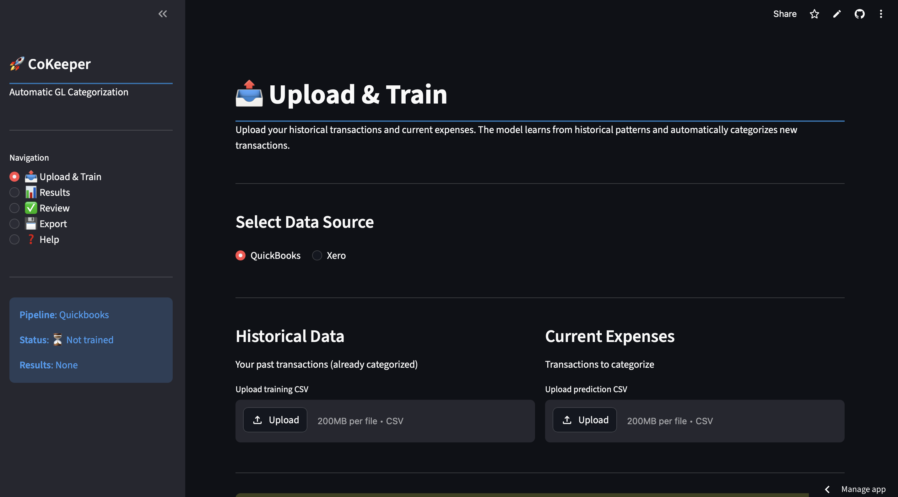

[← Back to Portfolio](../index.html)

# 🤖 CoKeeper v5.1 — AI-Powered GL Categorization
### Automating General Ledger classification for accountants using specialized ML pipelines.

> **Impact:** Reduces manual categorization time by ~16×, turning 8 hours of manual entry into 30 minutes of high-level review.

---

## 🎯 The Problem
Accountants spend significant billable hours manually sorting hundreds of bank transactions. The patterns are repetitive, but the data is "dirty"—merchant strings are inconsistent, containing transaction IDs, locations, and cryptic abbreviations that standard rule-based systems fail to catch.

## 🚀 The Solution: Confidence-Tiered Automation
CoKeeper doesn't just categorize; it assesses its own certainty. By outputting predictions in three confidence tiers, it creates a clear, trustworthy workflow for the user.

| Tier | Confidence | Accuracy | Action |
|------|-----------|----------|--------|
| **🟢 GREEN** | ≥ 80% | **99.2%** | Auto-import — no review needed |
| **🟡 YELLOW** | 50–80% | **94.8%** | Quick spot-check |
| **🔴 RED** | < 50% | **56.3%** | Manual review required |

**Success Metric:** ~59% of all transactions land in the **GREEN** tier, ready for instant import.

---

## 🖥️ Production Interface
The final output is an interactive **Streamlit Dashboard** where users manage the ML-driven categorization results.

<div align="center">
  
  <p style="color: #94a3b8; font-size: 0.9rem; font-family: 'JetBrains Mono', monospace;">
    // Live_Environment_Preview // UI_Confidence_Tiers_Enabled
  </p>
</div>

---

## 🏗 System Architecture
The system is built as a modular, serverless pipeline deployed on **GCP Cloud Run**.

### 1. Vendor Intelligence (5-Level Cascade)
A custom feature engineering system that resolves messy bank descriptions into clean vendor identities:
* **Level 0:** Normalization (stripping prefixes, locations, and phone numbers).
* **Level 1-2:** Exact and Fuzzy matching (SequenceMatcher ≥ 0.75).
* **Level 3:** Universal merchant database & Keyword inference.

### 2. Dual-Model Routing
Instead of a single classifier, CoKeeper routes data through two specialized **CatBoost** models:
* **Matched Vendor Model:** Used when Vendor Intelligence recognizes the merchant (92.1% accuracy).
* **Unmatched Vendor Model:** Relies on raw text features for unknown merchants (73.7% accuracy).

**Combined Test Accuracy: 89.3%**

---

## ⚙️ Logic Highlight: The Confidence Engine
This snippet demonstrates how the system converts raw model probabilities into actionable business tiers.

```python
def get_confidence_tier(probabilities: list[float]) -> dict:
    """
    Categorizes the prediction based on the model's top-1 certainty.
    Ensures 'Green' tier maintains near-perfect precision for auto-posting.
    """
    top_prob = max(probabilities)
    
    if top_prob >= 0.80:
        return {"tier": "GREEN", "action": "AUTO_POST", "color": "#22c55e"}
    elif top_prob >= 0.50:
        return {"tier": "YELLOW", "action": "SPOT_CHECK", "color": "#eab308"}
    else:
        return {"tier": "RED", "action": "MANUAL_REVIEW", "color": "#ef4444"}
